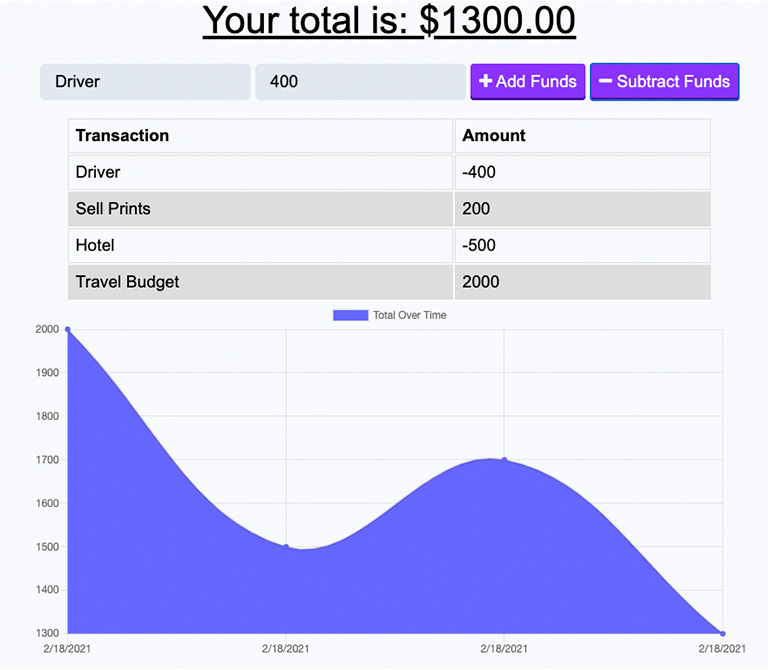

# [Track the Money](https://lit-retreat-52773.herokuapp.com/)

    
    
    
    

    
    

## Application description

This application will let you track your money (deposits and/or withdrawals) with or without an internet connection.

## Workflow

This homework assignment was pretty straight-forward. We had done a very similar activity as a mini project over a week ago. I did this with my Project 3 team and we were able to get it working locally. I thought I had followed along with my group in the Unsolved mini project activity for that day. So I tried to rework that logic for this homework assignment. It turned out I had missed a few things and I ended up looking at the Solved mini project activity. After hitting a bit of a wall trying to get it to deploy, I worked for a few hours with my study group to try and find the issue. Towards the end of working on it with Macz and I, Thomas wondered if I needed to link the database script on my index.html page. That was the last piece of the puzzle I needed to get it to work locally. Now I just needed to deploy to Heroku. I knew from a classmate that the servers were acting up. I also knew from some updates that power outages had knocked some servers down. I also knew that Heroku sometimes takes a while to deploy, so I chose to be patient with it deploying. However, it seems that I have to change my Atlas admin password for each Heroku deployment. Am I supposed to create a new admin for each database? I feel like I missed the instructions on that if there were any.

## Application Demo

To watch a video of the application being fully demo'd please use this link: [Application Demo](...).

## Technologies Used

  
  
  
  
  
  
  
  
  
  

## Resources

[Shields.io](https://shields.io/)

[Font Awesome](https://fontawesome.com/)

[Screencastify](https://www.screencastify.com/)

My Study Group

- [Bryson](https://github.com/Bryson-Palmer)
- [Ian](https://github.com/Ianaac27)
- [Macz](https://github.com/macz-norton)
- [Thomas](https://github.com/Tskading)
